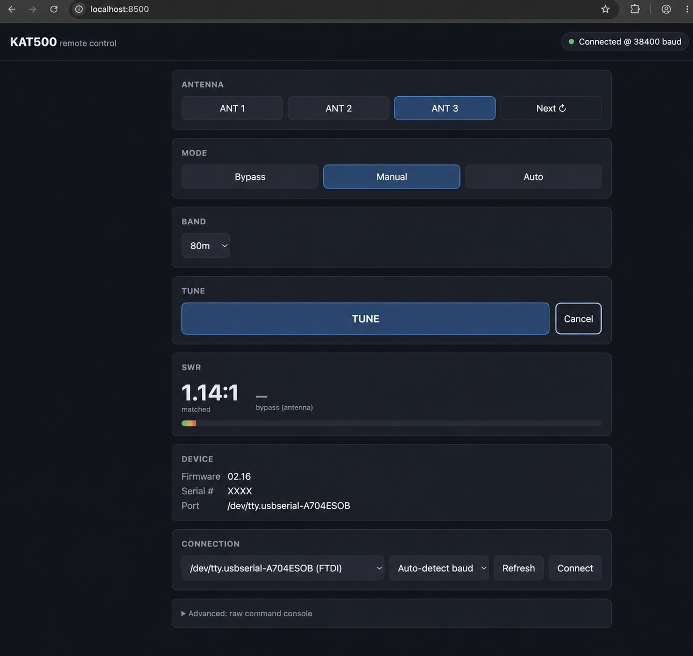

# KAT-500 Web App Remote

A browser-based remote control panel for the [Elecraft KAT500](https://elecraft.com/products/kat500) automatic antenna tuner — operate it from any browser tab (Chrome, Safari, mobile) instead of Elecraft's desktop-only utility.

Created by **K2COP**.



## Why this exists

The KAT500 has no display and no network interface of its own — it's a serial-only device, reachable exclusively over its rear-panel "PC DATA" RS-232 port. Elecraft's own `KAT500 Utility` covers that, but it's Windows/Mac desktop software tied to whatever machine it's installed on.

This project is the missing bridge: a small Node.js server with a USB-serial connection to the tuner, exposing a live control panel over HTTP/WebSocket so you can operate the tuner (antenna select, mode, tune, SWR, fault handling) from a browser anywhere on your network — or remotely, tunneled alongside your station's other remote-operating tools.

It talks to the KAT500 using the ASCII command set documented in Elecraft's own [KAT500 Serial Command Reference](https://ftp.elecraft.com/KAT500/Manuals%20Downloads/KAT500%20Automatic%20Antenna%20Tuner%20Serial%20Command%20Reference.pdf).

## Features

- **Power on/off** — logically power the KAT500 on or off over serial, same as holding the front-panel MODE button
- **Antenna select** — ANT 1/2/3, or cycle like the front-panel ANT button
- **Mode** — Bypass / Manual / Auto, with instant visual feedback on change
- **Band override**
- **Full search tune** — start/cancel, with a live tuning-in-progress indicator
- **Live telemetry** — SWR (matched and bypass/antenna), fault display with one-click clear
- **Device info** — firmware revision, serial number, connected port
- **Baud auto-detection** — probes 38400 / 19200 / 9600 / 4800, the same sequence Elecraft's own utility uses, so you don't need to know the tuner's configured speed
- **Auto-reconnect** — remembers the last working serial port and baud rate, and reconnects automatically after a server restart or a dropped connection
- **Advanced raw command console** — every GET command in Elecraft's reference works here (`AKIP`, `ST05A`, `DM`, etc.), for anything outside the main panel

## How it works

```
Browser (Chrome/Safari/mobile) <--HTTP/WebSocket--> Node.js server <--RS-232 (USB-serial)--> KAT500
```

The server owns a single serial connection to the tuner and enforces the flow-controlled request/response pacing the KAT500 expects, so multiple browser tabs can safely share one connection. It polls live values (SWR, fault, tune status) on an interval and pushes updates to every connected browser over a WebSocket, so the panel stays live without manual refreshing.

## Requirements

- An Elecraft KAT500, connected to your computer via its "PC DATA" serial port (USB-to-serial adapter or native serial port)
- [Node.js](https://nodejs.org/) (LTS)

## Setup

This app runs on whatever computer the KAT500's USB/serial cable is plugged into — that machine acts as the server, and any browser (on that machine or elsewhere on your network) connects to it. You don't need any programming experience to set it up, just the steps below.

### 1. Install Node.js

This is the program the server runs on top of.

1. Go to **https://nodejs.org** and download the version marked **LTS** (not "Current")
2. Run the installer with the default options

**Check it worked** — open a terminal (see below) and run:
```
node --version
```
You should see something like `v20.x.x`.

- **Windows:** open the Start Menu, type `cmd`, press Enter
- **macOS:** press `Cmd+Space`, type `Terminal`, press Enter

### 2. Get the code onto your computer

On this GitHub page, click the green **`<> Code`** button → **Download ZIP**, then extract it:
- **Windows:** right-click the downloaded ZIP → **Extract All**
- **macOS:** double-click the downloaded ZIP in Finder — it extracts automatically. Note the extracted folder will be named `kat-500-web-app-remote-main`.

*(If you're comfortable with git, `git clone https://github.com/K2COP/kat-500-web-app-remote.git` works too.)*

### 3. Open a terminal in that folder

- **Windows:** open the extracted folder in File Explorer, click in the address bar at the top, type `cmd`, press Enter — a command prompt opens already pointed at that folder.
- **macOS:** right-click the extracted folder in Finder → **New Terminal at Folder**. (If that option isn't there, open Terminal and type `cd ` followed by dragging the folder into the window, then press Enter.)

### 4. Install and start the app

In that terminal, run:
```
npm install
```
Wait for it to finish (downloads some files, ~30 seconds), then:
```
npm start
```
You should see `KAT500 web control listening on http://localhost:8500`. **Leave this window open** — closing it stops the app.

### 5. Plug in the KAT500 and connect

1. Connect the KAT500 to this computer via USB (through your USB-to-serial adapter, if that's how it's wired) and power it on.
2. Open Chrome or Safari and go to **http://localhost:8500**
3. In the **Connection** panel, pick your device from the port dropdown, leave baud on **Auto-detect**, and click **Connect**.

If the port doesn't show up in the list, the USB-to-serial adapter's driver probably isn't installed. Check what chip it uses (Windows: Device Manager; macOS: it'll be obvious from the port name, e.g. `SLAB_USBtoUART` = Silicon Labs, `usbserial` = FTDI) and grab the driver from [Silicon Labs](https://www.silabs.com/developers/usb-to-uart-bridge-vcp-drivers), [FTDI](https://ftdichip.com/drivers/vcp-drivers/), or your adapter's manufacturer.

### Next time

You don't need to repeat steps 1–2. Just repeat steps 3–4 (open a terminal in the folder, `npm start`) whenever you want to use it, then open the browser page again.

The server remembers your serial port and baud rate (in a `config.json` it creates on first connect — see `config.example.json` for the shape) and reconnects automatically every time it starts. Change `httpPort` there if `8500` conflicts with something else on your machine.

### Running alongside Elecraft's native app

Only one program can hold the KAT500's serial port at a time, but this app and Elecraft's own `KAT500 Utility` share it automatically — no manual quitting required, in either direction:

- **The server only holds the port while a browser tab of this app is actually open.** Close the last tab (or just don't open one) and the port sits free for the native app to grab.
- **If a browser tab is open and you launch the native app anyway**, the server detects it almost immediately (well under a second), releases the port, and gets out of the way. The native app opens normally.
- **When you quit the native app**, the server notices and reconnects automatically just as fast — no need to touch the browser tab; it'll pick back up on its own.
- It doesn't matter which browser or how many tabs — any open tab of this app counts as "in use." A page refresh briefly closes and reopens that tab's connection, which the server tolerates without bouncing the serial port.

In short: just open whichever one you want to use. The other gets out of the way by itself.

**Heads up:** run with `npm start` this way, the app only stays up as long as that terminal window/tab stays open — closing it (or Ctrl-C) stops the server. If you also run the [KPA500 web remote](https://github.com/K2COP/kpa500-web-app-remote) and each is running in its own terminal, closing/interrupting one won't affect the other — they're independent processes on different ports (8500 vs 8600) talking to different USB-serial adapters. If you want either to survive closing its terminal, see below.

### Keep it running automatically (macOS, recommended)

Instead of leaving a terminal window open, you can have macOS run the server in the background as a `launchd` agent — it starts automatically at login and restarts itself if it ever crashes, independent of any terminal.

1. Find your Node.js path: `which node` (copy the output).
2. Create `~/Library/LaunchAgents/com.k2cop.kat500-web-remote.plist`:
   ```xml
   <?xml version="1.0" encoding="UTF-8"?>
   <!DOCTYPE plist PUBLIC "-//Apple//DTD PLIST 1.0//EN" "http://www.apple.com/DTDs/PropertyList-1.0.dtd">
   <plist version="1.0">
   <dict>
       <key>Label</key>
       <string>com.k2cop.kat500-web-remote</string>
       <key>ProgramArguments</key>
       <array>
           <string><!-- paste `which node` output here --></string>
           <string><!-- absolute path to this project's server/index.js --></string>
       </array>
       <key>WorkingDirectory</key>
       <string><!-- absolute path to this project folder --></string>
       <key>RunAtLoad</key>
       <true/>
       <key>KeepAlive</key>
       <true/>
       <key>StandardOutPath</key>
       <string>~/Library/Logs/kat500-web-remote.log</string>
       <key>StandardErrorPath</key>
       <string>~/Library/Logs/kat500-web-remote.err.log</string>
   </dict>
   </plist>
   ```
3. Load it: `launchctl bootstrap gui/$(id -u) ~/Library/LaunchAgents/com.k2cop.kat500-web-remote.plist`

Useful commands afterward:
```
launchctl list | grep k2cop                                          # check it's running (shows a PID)
launchctl kickstart -k gui/$(id -u)/com.k2cop.kat500-web-remote       # restart it
launchctl bootout gui/$(id -u)/com.k2cop.kat500-web-remote            # stop it (until next login)
tail -f ~/Library/Logs/kat500-web-remote.log                          # watch its output
```
To stop it permanently, `bootout` it (above) and delete the `.plist` file.

### Keep it running automatically (Windows, recommended)

Windows doesn't have `launchd`, but Task Scheduler does the same job — runs the server in the background at login and restarts it if it crashes, without a terminal window open.

1. Find your Node.js path: open a command prompt and run `where node` (copy the first line it prints).
2. Open **Task Scheduler** (Start Menu → type "Task Scheduler").
3. In the right-hand panel, click **Create Task…** (not "Create Basic Task" — this one has the extra options we need).
4. **General** tab: name it `KAT500 Web Remote`. Leave the rest default.
5. **Triggers** tab → **New…** → Begin the task: **At log on** → OK.
6. **Actions** tab → **New…**:
   - Program/script: the path from step 1 (e.g. `C:\Program Files\nodejs\node.exe`)
   - Add arguments: `server\index.js`
   - Start in: the full path to this project folder (e.g. `C:\Users\YourName\kat-500-web-app-remote`)
   - OK
7. **Conditions** tab: uncheck "Start the task only if the computer is on AC power" if this is a laptop.
8. **Settings** tab: check **If the task fails, restart every:** and set it to `1 minute`, with a generous restart count (e.g. `999`).
9. Click **OK** to save (enter your Windows password if prompted).

The task also runs immediately the next time you log in. To test it now without logging out, find it in the Task Scheduler Library list, right-click → **Run**, then check **http://localhost:8500**.

To stop it permanently, right-click the task → **Disable** (or **Delete**).

## Remote operation

If you're already running a remote-station setup (e.g. [TCI Remote Compactor](https://pure-editions.com/on7off/TCI-Remote-Compactor/) alongside Thetis/openHPSDR for a Hermes Lite 2 or Apache Labs ANAN), you likely don't need a separate VPN for this. Compactor's **Remote Web Shortcuts** feature proxies local web interfaces (it lists "antenna tuner" as a built-in example) through its existing tunnel.

**If Compactor runs on the same computer this app's server is running on**, point a shortcut slot at `http://localhost:8500`.

**If Compactor runs on a different computer** (e.g. a separate shack PC running Thetis, while this app runs on whatever machine has the KAT500's USB-serial cable), `localhost` means *that* PC, not this one — point the shortcut at this machine's LAN IP instead, e.g. `http://192.168.1.50:8500`. Find this machine's LAN IP with `ipconfig getifaddr en0` (macOS) or `ipconfig` (Windows, look for "IPv4 Address"). Since most routers hand out that address via DHCP and it can change, consider setting a static IP or a DHCP reservation for this machine so the Compactor shortcut doesn't silently break later. If Compactor's shortcut field turns out to only accept `localhost`/`127.0.0.1` targets, fall back to a LAN-spanning tunnel instead (Tailscale, WireGuard, SSH port-forward) — those reach across machines regardless of what Compactor supports.

Any other tunnel/VPN that can reach the server's port (Tailscale, WireGuard, SSH port-forward, etc.) works just as well.

## Scope

This covers the "operate" surface — what you'd use remotely during a QSO. It intentionally does not cover the full configuration surface (per-band antenna enable/preference, VSWR thresholds, memory management) that Elecraft's desktop utility handles; those are one-time setup tasks best done locally with the KAT500 Utility.

## Related

Companion project: [KPA500 web remote](https://github.com/K2COP/kpa500-web-app-remote), for the Elecraft KPA500 linear amplifier — same bridge-server pattern, same look and feel.

## Disclaimer

This is an independent, community project and is not affiliated with, endorsed by, or supported by Elecraft, Inc. "Elecraft" and "KAT500" are trademarks of Elecraft, Inc. Use at your own risk — this software drives relays in your antenna tuner over a live RF path.

## License

[GPL-3.0](LICENSE) © K2COP
